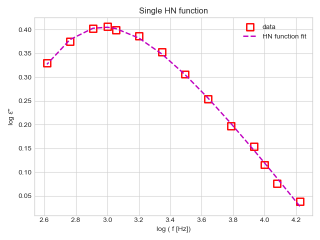

# HavNegpy

HavNegpy is a python fit package to anaylze dielectric spectroscopy data. 
HavNeg is an acronym for Havriliak and Negami function, and the fit module is written specifically to analyze the dielectric loss and real part of AC conductivity data.
Original code is from Mohamed Aejaz Kolmangadi, but I added some tweaks in the hn_deri.py module. Now it can fit up to a triple HN function, with both ohmic conductivity and universal dielectric response contributions.

# Installation
pip install HavNegpy

# Some fit examples

 

## AUTHOR

Mohamed Aejaz Kolmangadi, Federico Porcelli

## LOOKING FOR HELP?

Checkout the Tutorials here (https://github.com/mkolmang/Tutorials_HavNegpy)
