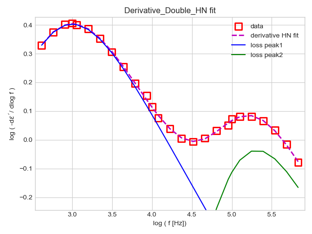
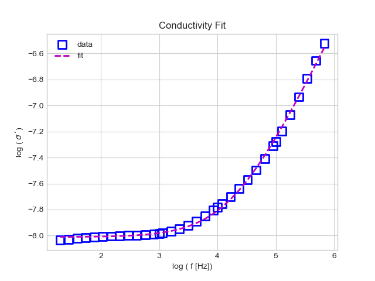
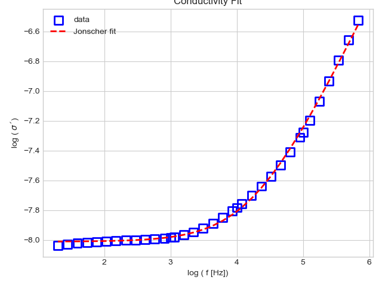

# HavNegpy

HavNegpy is a python fit package to anaylze dielectric data. 
HavNeg is an acronym for Havriliak and Negami function, and the fit module is based on this function.

# Some fit examples

 

## AUTHOR

Mohamed Aejaz Kolmangadi 

## LOOKING FOR HELP?

Checkout the Tutorials here (https://github.com/mkolmang/Tutorials_HavNegpy)
